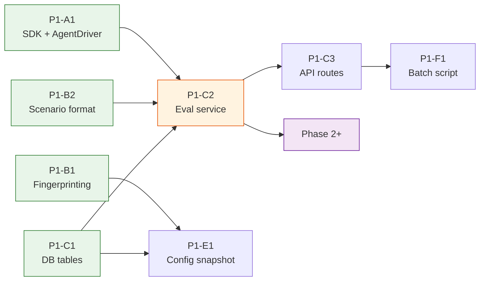

# Voice AI Evaluation Platform — Implementation Plan
### v1.0 | March 2026

> **Derived from** the [Design Proposal](./proposal.md), which explains the rationale and design approach.
> **The proposal is derived from** the [Requirements](./requirements.md), which define the metrics, targets, and acceptance criteria.

---

## Architecture

```
                    ┌──────────────────────────────────────────────┐
                    │  Scenarios + Evaluators + Scorecard           │
                    │  (identical regardless of driver)             │
                    ├──────────────────────────────────────────────┤
                    │  AgentDriver protocol                         │
                    │  send_turn(msg, history) → TurnResult         │
                    ├────────────────┬───────────────┬─────────────┤
                    │  HTTPDriver    │ DirectDriver  │ VoiceDriver │
                    │  /v1/chat/     │ pal-agents    │ LiveKit     │
                    │  (real system) │ (isolated)    │ (Phase 5)   │
                    └───────┬────────┴───────┬───────┴─────────────┘
                            │                │
                      pal-mono API     pal-agents agent
                      (real prompts,   (config snapshot,
                       real tools)      mock tools)
```

**Phase 1**: Everything runs inside pal-mono. `POST /v1/eval/run` triggers a background task that runs scenarios, evaluators, and writes results — all in-process. No Lambda, no SQS, no separate worker.

**When to extract**: When batch regression across 50+ restaurants takes too long or impacts API performance → extract the eval runner to a Lambda (same code, different trigger). The `AgentDriver` abstraction means the runner code doesn't change.

**Two repos (not three):**

**pal-agents** owns: Agent engine + Eval SDK + `AgentDriver` protocol + driver implementations + evaluator metrics.
**pal-mono** owns: Everything else — API routes, DB tables, scenario loading, eval runner (background task), results storage, Datadog metrics.

---

## Critical Path



Green = parallelizable on day 1. Orange = critical path bottleneck. Purple = Phase 2+.

---

## Evaluator Rollout (cross-cuts all phases)

Evaluators are independent, shippable pieces. Each phase doesn't require all evaluators — you add them incrementally. See Evaluator Catalog in proposal for full details (E1–E17).

**Phase 1 evaluators (ship with on-demand testing):**

| Order | Evaluator | Type | Effort | Why First |
|---|---|---|---|---|
| 1st | **E1 Tool Call Verification** | Deterministic | 1d | Quickest win. No LLM. Catches wrong POS tool calls immediately. |
| 2nd | **E3 Hours/Info Groundedness** | Deterministic + LLM | 1d | Catches wrong hours/address — customer shows up to closed restaurant. |
| 3rd | **E5–E7** (Responsive, Faithfulness, Voice Appropriate) | LLM judge | 0.5d (integration only) | Already built in pal-agents. Just wire into worker. |
| 4th | **E2 Menu Hallucination** | LLM judge | 1.5d | Agent invents menu items that don't exist. |
| 5th | **E4 Allergy Safety** | LLM judge | 1d | Zero-tolerance. Health risk. |
| 6th | **E8 Task Completion** | LLM judge | 0.5d (integration) | Already built in pal-agents. Wire in. |

**The minimum viable scorecard** for onboarding is E1 + E3 + E5 (tool calls correct, facts grounded, agent responsive). This can ship in the first week of Phase 1, before the full platform is done. Everything after that adds coverage.

**Phase 2 evaluators (add to production scoring):**
- Same as Phase 1 evaluators, but running on real call transcripts instead of simulated scenarios.

**Phase 3+ evaluators (add when core is stable):**
- E10 Adversarial Resistance, E11 Escalation Correctness, E12 Topic Continuity, E13 Upsell Compliance

**Phase 5 evaluators (audio-native):**
- E14–E17 (interruption handling, silence detection, STT accuracy, speech tempo)

---

## Phase 1: On-Demand Testing + Agent Fingerprinting (Weeks 1–4)

### Wave 1A — Foundation (Days 1–3, fully parallel)

---

#### P1-A1 · pal-agents: Extract eval SDK + AgentDriver abstraction
**Repo**: pal-agents
**Effort**: 2.5 days

**Files to modify**:
- `pyproject.toml` — add `[project.optional-dependencies] eval = ["deepeval", "httpx", ...]` extras group
- `evals/__init__.py` — export public API: `AgentDriver`, `HTTPDriver`, `DirectDriver`, `ConversationRunner`, `UserSimulator`, `ConversationMetrics`, `MenuMetrics`

**Files to create**:
- `evals/drivers/__init__.py`
- `evals/drivers/protocol.py` — `AgentDriver` protocol + `TurnResult` dataclass:
  ```python
  class AgentDriver(Protocol):
      async def send_turn(self, message: str, history: list[Turn]) -> TurnResult: ...

  @dataclass
  class TurnResult:
      response: str
      tool_calls: list[ToolCall]
      latency_ms: float
      metadata: dict  # driver-specific extras
  ```
- `evals/drivers/http.py` — `HTTPDriver(base_url, recipient_identifier, sender_prefix)` — sends to `/v1/chat/`, parses response. Extracted from existing `LocalAgentClient` + `HTTPConversationRunner`.
- `evals/drivers/direct.py` — `DirectDriver(agent_config_snapshot)` — thin adapter wrapping LiveKit's built-in `AgentSession.run()` + `mock_tools()` testing framework behind the `AgentDriver` protocol. Captures tool calls. Returns response.
- `evals/drivers/mock_tools.py` — Mock tool registry. Each mock records `(tool_name, args)` and returns configurable canned responses.

**Files to refactor**:
- `evals/conversation/runner.py` — `ConversationRunner` now accepts any `AgentDriver` instead of hardcoded `HTTPConversationRunner`. Existing behavior preserved when using `HTTPDriver`.
- `evals/client.py` — extracted into `evals/drivers/http.py`; old import path kept as alias for backward compat
- `evals/simulator.py` — make `UserSimulator` accept `model_id` param (default Claude Sonnet 4)

**What to remove from SDK surface**:
- CLI `main()` functions and `argparse` parsing (stay in scripts, not exported)
- `print()` progress output (replace with `logging`)
- Hardcoded `AGENT_CONFIGS` dict
- Hardcoded dataset file paths

**Acceptance criteria**:
- `from pal_agents.evals.drivers import HTTPDriver, DirectDriver` works
- `ConversationRunner(driver=HTTPDriver(...))` produces identical results to current behavior
- `ConversationRunner(driver=DirectDriver(config_snapshot))` runs conversations without pal-mono
- `DirectDriver` mock tools capture tool calls; canned responses are configurable per tool
- `pip install pal-agents[eval]` installs all dependencies
- Existing CLI scripts still work unchanged

---

#### P1-B1 · pal-mono: Agent fingerprinting
**Repo**: pal-mono
**Effort**: 2 days

**Files to create**:
- `services/agent_service/_fingerprint.py` — `compute_agent_fingerprint(agent_config, canonical_prompt_v2, knowledge_snapshot_id=None) -> tuple[str, str, dict]` returning `(agent_fingerprint, prompt_fingerprint, config_dict)`. Uses a canonicalized JSON payload and excludes ephemeral runtime context such as current timestamp.

**Files to modify**:
- `services/prompt_service/prompts_v2.py` — add `build_with_hash()` method to `PromptFactoryV2` that returns `tuple[str, str]` (canonical_prompt_text, prompt_hash). The hash is over stable Prompt V2 content only, not runtime context.
- `services/agent_service/_raw_config.py` — after `RawConfig.build()` completes, call `compute_agent_fingerprint()`. Add `build_with_fingerprint()` method returning `tuple[AgentConfig, str, str, dict]` (config, agent_fp, prompt_fp, config_dict).
- `db/tables/conversations.py` — add `agent_fingerprint: Mapped[str | None] = mapped_column(String(64), nullable=True, index=True)` and `prompt_fingerprint: Mapped[str | None] = mapped_column(String(64), nullable=True, index=True)`
- `db/migrations/versions/` — `alembic revision --autogenerate -m "add-agent-fingerprint-to-conversations"`
- `api/routes/internal/_voice.py` — in voice init handler, after `RawConfig.build()`, store fingerprints on Conversation row
- `events/schema.py` — add `agent_fingerprint`, `prompt_fingerprint`, `model_identifier` fields to `ConversationEvaluationRequested`

**Gotcha**: Do NOT change `RawConfig.build()` return type — it would break every caller. Add a new `build_with_fingerprint()` method instead.

**Canonicalization rules**:
- Hash Prompt V2 content only. Do not include legacy Prompt V1 prompt text in the fingerprint design.
- Exclude ephemeral runtime context from the fingerprint payload, especially `additional_context` values derived from current time.
- If knowledge content has its own revision marker, include that revision marker in `config_dict`; otherwise hash only stable knowledge settings and accept that content changes are outside the Phase 1 fingerprint boundary.

**Acceptance criteria**:
- Every new voice call has `agent_fingerprint` populated on the Conversation row
- `ConversationEvaluationRequested` event includes fingerprint fields
- Same config always produces same fingerprint (deterministic)
- Changing any Prompt V2 capability action text, model, tool config, or feature flag state changes the fingerprint
- `./scripts/validate.sh` passes

---

#### P1-B2 · pal-mono: Scenario format + storage + CRUD
**Repo**: pal-mono
**Effort**: 1.5 days

**Context**: FDEs manually author scenarios per restaurant during onboarding. They know the POS type, menu, hours, and edge cases. Auto-generation comes later — Phase 1 is manual-first.

**Files to create**:
- `services/eval_service/__init__.py`
- `services/eval_service/_scenario_loader.py` — `load_scenarios(project_id) -> list[EvalScenario]` loads generic + project YAML files from disk; `validate_scenarios_from_yaml(yaml_path) -> list[EvalScenario]` validates FDE-authored files before they are checked in
- `services/eval_service/schema.py` — Pydantic models: `EvalScenario`, `EvalRunRequest`, `EvalRunResponse`, `ScorecardResponse`

**Scenario YAML format** (aligned with pal-agents' existing `multi_turn_v4.json` pattern):
```yaml
# scenarios/pizza-guys/ordering.yaml
- scenario_id: order_pepperoni
  scenario: "Customer orders a large pepperoni pizza"
  test_category: ordering
  persona: standard_customer
  user_turns:
    - "Hi, I'd like to order a large pepperoni pizza"
    - type: ai_driven  # LLM persona reacts to agent response
      goal: "Confirm order and complete"
  expected_tool_calls:
    - tool: toast_tool.create_order
      args:
        item: pepperoni
        size: large
  expected_outcomes:
    task_completed: true
    hallucination: false
  context:
    - "Large pepperoni pizza is $14.99"
    - "POS system is Toast"
```

**Generic scenario library** (shared across all restaurants):
- `services/eval_service/scenarios/generic/` — adversarial, escalation, topic switch, greeting, allergy safety
- Shipped with pal-mono, always included in every eval run

**Acceptance criteria**:
- FDE can author a YAML scenario file and import it for a specific project
- Generic scenarios (10 minimum) ship with pal-mono and apply to all projects
- `load_scenarios(project_id)` returns generic + per-restaurant scenarios combined
- Unit tests cover YAML parsing, validation, and import

---

### Wave 1B — Data Model (Days 3–5)

---

#### P1-C1 · pal-mono: Eval tables — 3 new tables
**Repo**: pal-mono
**Effort**: 1.5 days

**Files to create**:
- `db/tables/eval_runs.py` — `EvalRun` table: id, project_id, account_id, agent_fingerprint, driver_mode, status (pending/running/completed/failed), triggered_by (api/scheduler/ci), scenario_count, passed_count, failed_count, overall_score, started_at, completed_at, error_message
- `db/tables/eval_results.py` — `EvalResult` table: id, eval_run_id, scenario_id (string — matches YAML scenario_id), conversation_id (nullable — links to prod call if scoring production), agent_fingerprint, metric_name, score, passed, reason (judge explanation), raw_output (JSONB), evaluated_at
- `db/tables/agent_config_snapshots.py` — `AgentConfigSnapshot` table: fingerprint (PK, 64-char hex), agent_id, project_id, system_prompt_hash, system_prompt_text, config_snapshot (JSONB), first_seen_at, last_seen_at

Scenarios are **not** stored in the database. They're YAML files — version-controlled, PR-reviewable, authored by FDEs. The `scenario_id` field on `EvalResult` is a string that matches the `scenario_id` in the YAML file.

**Files to modify**:
- `db/tables/__init__.py` — export all 3 new models (MUST do this before generating migration)
- `db/migrations/versions/` — `alembic revision --autogenerate -m "add-eval-tables"`

**Gotcha**: Empty migration = you forgot to export models in `__init__.py`.

**Acceptance criteria**:
- `alembic upgrade head` applies cleanly
- `alembic downgrade -1` reverses cleanly
- All 3 tables visible in psql with correct columns, types, and indexes

---

#### P1-C2 · pal-mono: Eval service — runner + evaluators + result storage
**Repo**: pal-mono
**Effort**: 3 days

Eval runs in-process as a FastAPI background task. No separate worker, no Lambda, no SQS. `POST /v1/eval/run` returns 202 immediately; the eval runs in the background and writes results to DB when done.

**Files to create**:
- `services/eval_service/_implementation.py` — implements:
  - `create_eval_run(project_id, account_id, driver_mode, triggered_by, session)` — creates EvalRun row, kicks off `_run_eval_background(eval_run_id, project_id, driver_mode)` as a background task
  - `_run_eval_background(eval_run_id, project_id, driver_mode)` — creates and owns its own `AsyncSessionLocal()`, loads scenarios from YAML, constructs `AgentDriver` (HTTPDriver or DirectDriver), runs `ConversationRunner` + evaluators, writes results to DB, updates run status
  - `write_eval_result(result, session)` — stores individual evaluator result
  - `get_eval_results(run_id, session)`
  - `get_scorecard(project_id, limit, session)` — aggregates last N runs per metric
- `services/eval_service/_evaluators.py` — orchestrates evaluators per scenario:
  - Imports E1–E4 (custom evaluators, built here) + E5–E9 (from pal-agents SDK)
  - Runs deterministic evaluators first (E1 tool call, E3 groundedness), then LLM judges in parallel
  - Returns list of `EvalResult` per scenario
- `services/eval_service/evaluators/` *(new directory)* — one file per custom evaluator:
  - `tool_call.py` — **E1**: compare expected vs actual tool calls from `TurnResult.tool_calls`. Deterministic.
  - `menu_hallucination.py` — **E2**: verify menu items mentioned exist in context. LLM judge.
  - `groundedness.py` — **E3**: verify factual claims against project data. Deterministic + LLM.
  - `allergy_safety.py` — **E4**: verify allergy answers are grounded or defer. Zero-tolerance.
- `db/repositories/eval_run_repository.py` — `create`, `get_by_id`, `update_status`, `list_by_project`
- `db/repositories/eval_result_repository.py` — `create`, `list_by_run`, `list_by_conversation`
- `db/repositories/agent_config_snapshot_repository.py` — `upsert` (insert or update `last_seen_at`)

**Files to modify**:
- `db/repositories/__init__.py` — export 3 new repos
- `events/schema.py` — add `EvalRunRequested` event (for future Lambda extraction; not consumed yet in Phase 1)

**Acceptance criteria**:
- `POST /v1/eval/run` returns 202 immediately, eval runs in background
- `GET /v1/eval/runs/{run_id}` shows status progression: pending → running → completed
- Eval with HTTPDriver runs scenarios through `/v1/chat/` — tests real system
- Eval with DirectDriver runs scenarios in-process — no external deps
- Same evaluators produce comparable scores regardless of driver
- 10-scenario run completes in < 5 min (http) or < 2 min (direct)
- `get_scorecard()` returns per-metric pass rates across last N runs
- Background eval owns its own DB session and does not reuse the request-scoped session

---

### Wave 1C — API + Snapshot (Days 6–10)

---

#### P1-C3 · pal-mono: Eval API routes
**Repo**: pal-mono
**Effort**: 1 day

**Files to create**:
- `api/routes/eval/__init__.py` — `eval_router = APIRouter(prefix="/eval")`
- `api/routes/eval/_implementation.py` — thin handlers delegating to `eval_service`
- `api/schemas/eval/requests.py` — `RunEvalRequest(project_id, driver: "http" | "direct" = "http", triggered_by)`
- `api/schemas/eval/responses.py` — `EvalRunResponse`, `EvalResultsResponse`, `ScorecardResponse`

**Files to modify**:
- `api/routes/endpoints.py` — add `EVAL = "/eval"`
- `api/routes/v1_router.py` — `v1_router.include_router(eval_router)`
- `api/schemas/admin/conversation.py` — add `agent_fingerprint: str | None = None` and `prompt_fingerprint: str | None = None` to both `Conversation` and `ConversationDetail` schemas (fingerprints are stored on every voice call via P1-B1 but never surfaced through admin conversation routes without this)
- `api/routes/admin/_builder.py` — update `build_conversation(...)` and `build_conversation_detail(...)` to map `agent_fingerprint` and `prompt_fingerprint` from `db.Conversation` into response schemas

**Routes**:
```
POST   /v1/eval/run                            → trigger eval for a project (returns 202 + run_id)
GET    /v1/eval/runs/{run_id}                  → get run status + results
GET    /v1/eval/scorecard/{project_id}         → aggregated scorecard
```

**Acceptance criteria**:
- `POST /v1/eval/run` returns 202 Accepted with `run_id`
- `GET /v1/eval/scorecard/{project_id}` returns per-metric pass rates + trend vs previous run
- OpenAPI docs accurate

---

#### P1-E1 · pal-mono: Agent config snapshot on call init
**Repo**: pal-mono
**Effort**: 1 day

**Files to create**:
- `services/eval_service/_snapshot.py` — `upsert_agent_config_snapshot(fingerprint, agent_id, project_id, config_dict, prompt_hash, prompt_text, session)`

**Files to modify**:
- `api/routes/internal/_voice.py` — after fingerprint computed, fire-and-forget background task to upsert snapshot

**Session ownership**:
- The snapshot upsert task must create and own its own `AsyncSessionLocal()`.
- Do not pass the request-scoped DB session into the fire-and-forget task.

**Acceptance criteria**:
- After 10 calls with same config: exactly 1 snapshot row, `last_seen_at` updated
- After capability change: new row with new fingerprint
- Background task does not block voice init response (< 1ms added to call setup)

---

#### P1-F1 · pal-mono: Batch eval CLI script
**Repo**: pal-mono
**Effort**: 0.5 days

**Files to create**:
- `scripts/run_eval_batch.py` — CLI: `uv run python scripts/run_eval_batch.py [--project-id UUID | --all-active] [--env lat|stg|prd]`
  - Calls `POST /v1/eval/run` for each project
  - Polls `GET /v1/eval/runs/{run_id}` until complete (with timeout)
  - Prints scorecard table to stdout
  - Exit code 0 if all pass, 1 if any fail

**Acceptance criteria**:
- `--all-active` runs evals for all active projects
- Summary table shows per-project pass/fail + overall score
- Usable from GitHub Actions

---

## Phase 2: Audio-Native Evaluation (Weeks 5–8)

> Full proposal: `docs/plans/conversation-eval/phase2-audio-native-proposal.md`

**Key finding**: LiveKit already provides interruption events, state change timestamps, and dual-channel recording — we just aren't capturing them. The gap is instrumentation, not signal processing. Three of the four audio evaluators (E14 interruptions, E15 latency, E15 silence) come free once we instrument the voice worker.

---

#### P2-A1 · Instrument LiveKit voice worker
**Repo**: pal-livekit-agent-cloud
**Effort**: 3 days

The highest-leverage task in the entire eval platform. Subscribe to LiveKit session events (`overlapping_speech`, `user_state_changed`, `agent_state_changed`, `metrics_collected`), accumulate into a `CallMetricsReport`, switch to dual-channel recording, send the report with the end-call request.

**Acceptance criteria**:
- Every voice call produces a `CallMetricsReport` with per-turn timestamps and latencies
- Audio recording is stereo OGG (agent L, caller R) via `DUAL_CHANNEL_AGENT` or `RecorderIO`
- `turn_latencies_ms` populated (no longer `[]`)
- Transcript `start_time` / `end_time` populated (no longer `0.0`)
- Interruption events captured with `is_interruption` flag

---

#### P2-A2 · pal-mono: Receive and store audio metrics
**Repo**: pal-mono
**Effort**: 1.5 days

Extend `VoiceEndCallRequest` to accept `CallMetricsReport`. Populate existing `PhoneCall` latency columns. Include real metrics in `ConversationEvaluationRequested` event.

**Acceptance criteria**:
- `ConversationEvaluationRequested` event includes real turn latencies and interruption data
- `PhoneCall.turn_latency_avg` populated for every call

---

#### P2-B1 · Audio evaluators (E14–E18)
**Repo**: pal-agents + pal-mono
**Effort**: 3 days

| Priority | Evaluator | Approach | Audio Processing? |
|---|---|---|---|
| 1st | E15 Response latency | From `turn_latencies_ms` — pure arithmetic | ❌ No |
| 2nd | E14 Interruption handling | From `interruption_events` — count + stop latency | ❌ No |
| 3rd | E15 Silence gaps | From turn timestamps — find gaps | ❌ No |
| 4th | E16 STT accuracy (WER) | Whisper on caller channel vs. Deepgram transcript + jiwer | ✅ Yes |
| 5th | E17 Speech rate / audio quality | whisper-timestamped + librosa on recording | ✅ Yes |
| 6th | E18 Speech fidelity | LALM-as-Judge (GPT-4o audio) on agent channel | ✅ Yes |

First 3 evaluators ship for zero audio processing effort — they come from the instrumented events.

---

#### P2-C1 · pal-agents: VoiceDriver for end-to-end voice simulation
**Repo**: pal-agents
**Effort**: 2 days

Third `AgentDriver` implementation. Synthesizes caller voice via TTS, places SIP call via LiveKit, captures dual-channel recording + metrics. Enables `POST /v1/eval/run { driver: "voice" }`.

**Acceptance criteria**:
- VoiceDriver places actual calls via LiveKit SIP
- Returns `TurnResult` with transcript + tool_calls + audio metrics
- Scenarios with `persona: accented_customer` synthesize accented speech

---

### Phase 2 Summary

| Task | Repo | Effort | Depends On |
|------|------|--------|------------|
| P2-A1 Instrument voice worker | pal-agents | 3d | — |
| P2-A2 Receive + store audio metrics | pal-mono | 1.5d | P2-A1 |
| P2-B1 Audio evaluators (E14–E18) | pal-agents + pal-mono | 3d | P2-A1, P2-A2 |
| P2-C1 Voice call simulation | pal-agents + pal-mono | 5d | P2-A1 |
| **Phase 2 total** | | **12.5d** | |

---

## Phase 3: Score Production Calls (Weeks 9–11)

---

#### P3-A1 · pal-mono: Score production calls via EventBridge consumer
**Repo**: pal-mono
**Effort**: 2 days

Reuses evaluators from Phase 1 (transcript) + Phase 2 (audio), triggered by the existing `ConversationEvaluationRequested` event. Runs as an EventBridge consumer in pal-mono.

**Files to create**:
- `services/eval_service/_production_scorer.py` — `score_production_call(event)`:
  1. Run deterministic evaluators against `tool_calls` from event payload
  2. Build `ConversationalTestCase` from transcript, score with E5–E9
  3. If `audio_recording_s3_uri` present, run audio evaluators (E14–E17)
  4. Write results to DB linked to `conversation_id` + `agent_fingerprint`

**Files to modify**:
- `events/handlers/` — add handler for `ConversationEvaluationRequested` → calls `score_production_call()`

**Acceptance criteria**:
- Every production voice call scored within 60s of call end
- Results include both transcript-level AND audio-level scores
- Results stored in `eval_results` linked to `conversation_id`
- Zero impact on live call path (fully async post-call)

---

#### P3-A2 · pal-mono: Per-conversation scores API
**Repo**: pal-mono
**Effort**: 0.5 days

**Files to modify**:
- `api/routes/eval/_implementation.py` — add `GET /v1/eval/conversation/{conversation_id}/scores`
- `services/eval_service/_implementation.py` — add `get_conversation_scores(conversation_id, session)`

**Acceptance criteria**:
- Returns all metric scores (transcript + audio) for a specific call

---

#### P3-B1 · pal-mono: Datadog quality metrics
**Repo**: pal-mono
**Effort**: 1 day

**Files to modify**:
- `services/eval_service/_implementation.py` — after writing each `EvalResult`, emit Datadog gauge: `eval.metric_score` with tags `metric`, `project`, `agent_fingerprint`

**Acceptance criteria**:
- Datadog dashboard shows per-project, per-metric score trends
- Sliceable by agent_fingerprint (to compare agent versions)

---

## Phase 4: Monitoring + Feedback Loop (Weeks 12–14)

---

#### P4-A1 · pal-mono: Anomaly detection + alerting
**Repo**: pal-mono
**Effort**: 2 days

**Files to create**:
- `services/eval_service/_anomaly.py` — `detect_regressions(project_id, window_hours, baseline_days, session)`: compares current window scores vs rolling baseline per metric. Flags if delta exceeds threshold.

**Files to modify**:
- `events/schema.py` — add `EvalRegressionDetected` event
- Slack integration — post alert with metric name, delta, project, fingerprint

**Acceptance criteria**:
- Quality drop >15% in 1-hour window vs 7-day baseline → Slack alert within 10 min
- Any hallucination detected → immediate alert

---

#### P4-A2 · pal-mono: Promote production failure to regression test
**Repo**: pal-mono
**Effort**: 1.5 days

**Files to modify**:
- `api/routes/eval/_implementation.py` — add `POST /v1/eval/scenarios/promote`
- `services/eval_service/_scenario_loader.py` — add `promote_from_conversation(conversation_id, session) -> EvalScenario`

**Acceptance criteria**:
- One API call promotes a failed call to a regression scenario
- Promoted scenario included in next eval run for that project

---

## Phase 5: CI Quality Gates (Weeks 15–17)

---

#### P5-A1 · pal-mono: GitHub Actions eval gate
**Repo**: pal-mono
**Effort**: 1.5 days

**Files to create**:
- `.github/workflows/eval_gate.yml` — triggers on PR to `main` touching prompts/tools/agent logic; runs `scripts/run_eval_batch.py --all-active`; posts PR comment; fails if regression >5%

**Files to modify**:
- `scripts/run_eval_batch.py` — add `--baseline-run-id` flag for delta comparison; add `--output json` for CI parsing

**Acceptance criteria**:
- PR degrading task completion >5% is blocked
- Gate completes in <10 min (parallel execution)
- PR comment shows per-project, per-scenario score deltas

---

## Summary

| Task | Repo | Effort | Depends On | Phase |
|------|------|--------|------------|-------|
| P1-A1 SDK + AgentDriver | pal-agents | 2.5d | — | 1 |
| P1-B1 Fingerprinting | pal-mono | 2d | — | 1 |
| P1-B2 Scenario format + CRUD | pal-mono | 1.5d | — | 1 |
| P1-C1 DB tables | pal-mono | 1.5d | — | 1 |
| P1-C2 Eval service + evaluators | pal-mono | 3d | A1, B2, C1 | 1 |
| P1-C3 API routes | pal-mono | 1d | C2 | 1 |
| P1-E1 Config snapshot | pal-mono | 1d | B1, C1 | 1 |
| P1-F1 Batch script | pal-mono | 0.5d | C3 | 1 |
| **Phase 1 total** | | **13d** | | **~8 cal days w/ 2 eng** |
| P2-A1 Instrument voice worker | pal-agents | 3d | — | 2 |
| P2-A2 Receive + store audio metrics | pal-mono | 1.5d | P2-A1 | 2 |
| P2-B1 Audio evaluators (E14–E18) | pal-agents + pal-mono | 3d | P2-A1, P2-A2 | 2 |
| P2-C1 Voice call simulation | pal-agents + pal-mono | 5d | P2-A1 | 2 |
| **Phase 2 total** | | **12.5d** | | |
| P3-A1 Prod call scoring | pal-mono | 2d | C2, B1 | 3 |
| P3-A2 Scores API | pal-mono | 0.5d | P3-A1 | 3 |
| P3-B1 Datadog metrics | pal-mono | 1d | P3-A1 | 3 |
| **Phase 3 total** | | **3.5d** | | |
| P4-A1 Anomaly detection | pal-mono | 2d | P3-A1 | 4 |
| P4-A2 Promote to test | pal-mono | 1.5d | C1 | 4 |
| **Phase 4 total** | | **3.5d** | | |
| P5-A1 CI gate | pal-mono | 1.5d | F1 | 5 |
| **Phase 5 total** | | **1.5d** | | |
| **Grand total** | | **~34d** | | |

---

## Key Gotchas

1. **Don't break `RawConfig.build()` signature** — add `build_with_fingerprint()` instead. Every voice init call and every test that calls `build()` would break otherwise.
2. **Same for `PromptFactoryV2.build()`** — add `build_with_hash()` as a new method.
3. **Export new tables in `db/tables/__init__.py` BEFORE running `alembic revision --autogenerate`** — otherwise you get an empty migration.
4. **Background task for snapshot** — `upsert_agent_config_snapshot()` must be fire-and-forget and must own its own `AsyncSessionLocal()`. Never block voice init or reuse the request-scoped session.
5. **Background task for eval** — `_run_eval_background()` runs in a FastAPI background task and must own its own `AsyncSessionLocal()`. If pal-mono restarts mid-eval, the run stays in `status: "running"` forever. Add a startup check that marks stale running evals as failed.
6. **`ConversationEvaluationRequested` already fires** — Phase 2 just consumes it. Fingerprint fields are added in P1-B1.
7. **Extract to Lambda later** — when batch eval across 50+ restaurants impacts the API, move `_run_eval_background()` to a Lambda. The `AgentDriver` abstraction means the runner code doesn't change. The `EvalRunRequested` event schema is already defined for this purpose.
