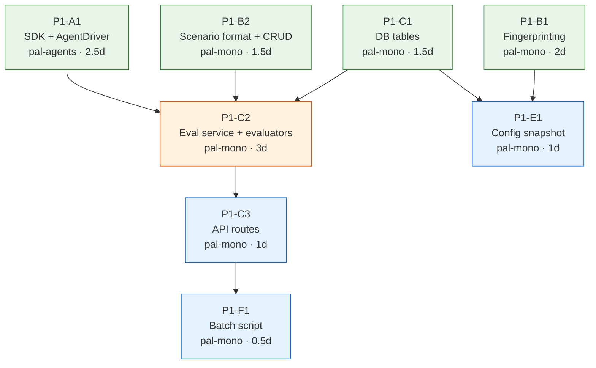
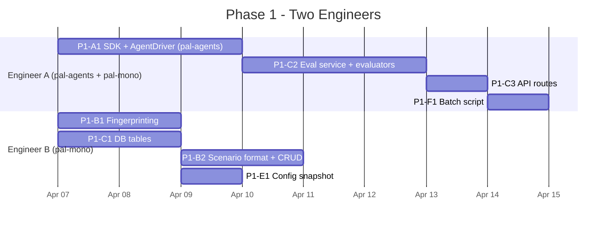
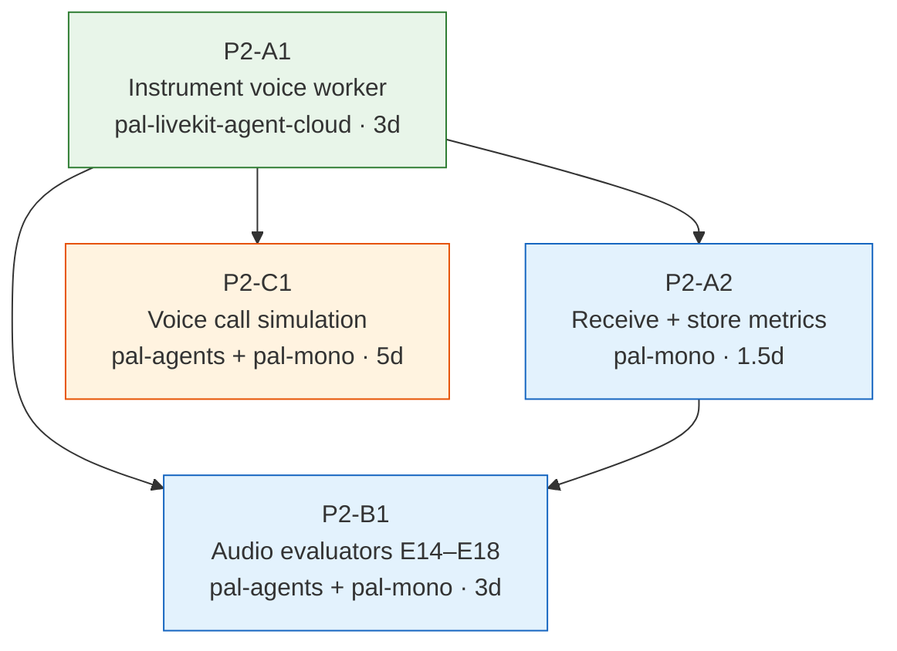
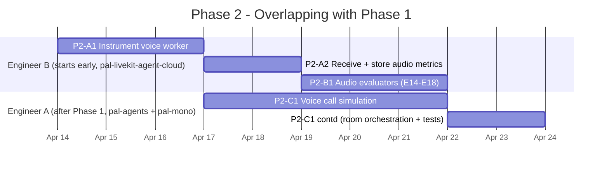
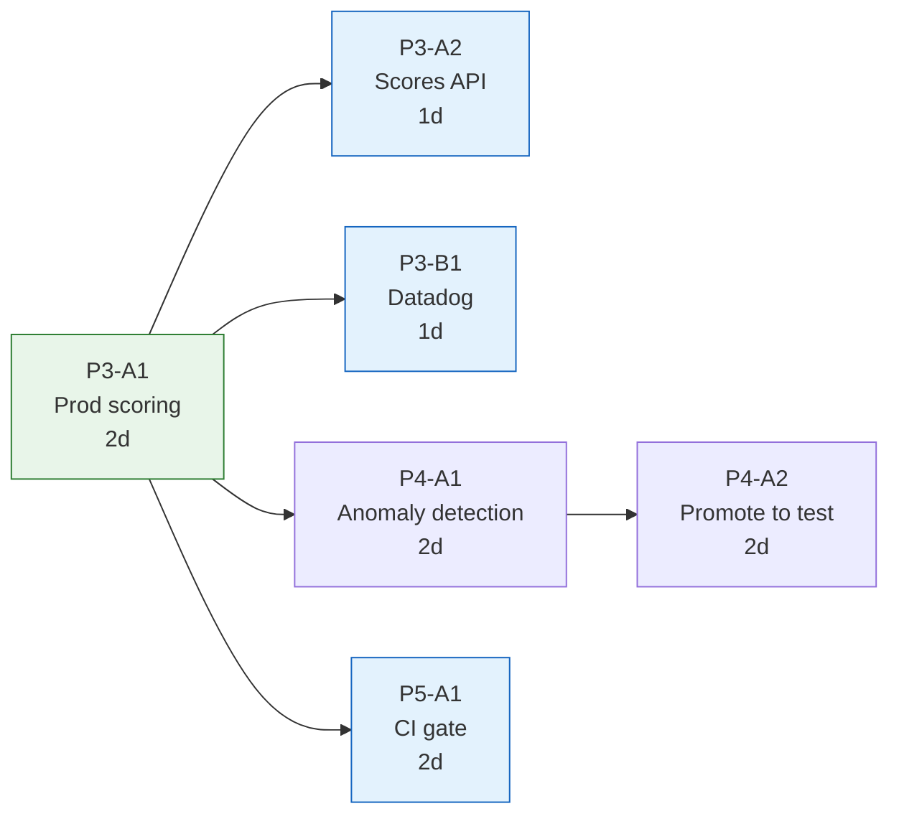
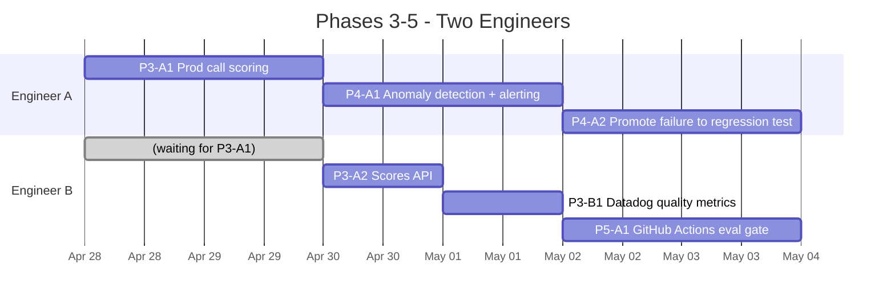
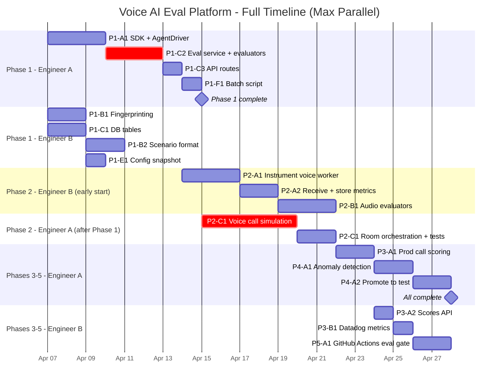
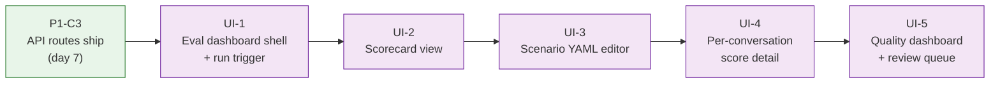
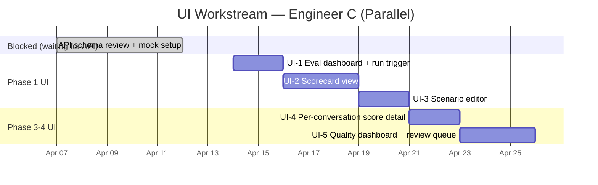

# Voice AI Evaluation Platform — Timeline & Staffing
### March 2026

---

## Overview

| Phase | Calendar Weeks | Eng-Days | Max Parallel Engineers |
|-------|---------------|----------|----------------------|
| **Phase 1**: On-demand testing + fingerprinting | Weeks 1-2 | 15d | 2 |
| **Phase 2**: Audio-native evaluation | Weeks 2-4 (overlaps Phase 1) | 15d | 2 |
| **Phases 3-5**: Prod scoring + monitoring + CI | Weeks 4-5 | 10d | 2 |
| **Total** | **~5 weeks** | **~40d** | |

With 2 engineers throughout and aggressive cross-phase overlap, calendar time compresses from ~13 weeks to ~5. Engineer B starts Phase 2 work (P2-A1) while Engineer A finishes Phase 1. Phases 3-5 run with 2 engineers in parallel since most tasks only depend on P3-A1.

---

## Phase 1: On-Demand Testing + Fingerprinting

### Dependency Graph

Green = no dependencies (start day 1). Orange = critical path. Blue = dependent work.

### Staffing: 2 Engineers, ~8 Calendar Days

| Day | Engineer A | Engineer B |
|-----|-----------|-----------|
| 1–2 | P1-A1 SDK + AgentDriver (pal-agents) | P1-B1 Fingerprinting + P1-C1 DB tables |
| 3 | P1-A1 finishes | P1-B2 Scenario format |
| 4–5 | P1-C2 Eval service + evaluators | P1-B2 finishes → P1-E1 Config snapshot |
| 6 | P1-C2 finishes | Available for review / FDE scenario authoring |
| 7 | P1-C3 API routes | Review + integration testing |
| 8 | P1-F1 Batch script | End-to-end validation |

**Critical path**: A1 → C2 → C3 → F1 (2.5 + 3 + 1 + 0.5 = 7 working days, ~8 calendar days with rounding). Engineer B's work feeds into C2 (needs DB tables + scenario format) but finishes before C2 starts on day 4.

**Phase 1 output**: FDE can run `POST /v1/eval/run { project_id, driver: "http" }` and get a scorecard for any restaurant.

---

## Phase 2: Audio-Native Evaluation

### Dependency Graph

### Staffing: 2 Engineers, overlapping with Phase 1

| Day | Engineer A | Engineer B |
|-----|-----------|-----------|
| P1 Day 6-8 | Finishing Phase 1 (C3, F1) | P2-A1 Instrument voice worker (starts early) |
| P2 Day 1-2 | P2-C1 Voice call simulation | P2-A2 Receive + store audio metrics |
| P2 Day 3-5 | P2-C1 continued | P2-B1 Audio evaluators (E14-E18) |
| P2 Day 6-7 | P2-C1 Room orchestration + tests | P2-B1 finishes, review |

**Key optimization**: P2-A1 (instrument voice worker) has zero Phase 1 dependencies — it instruments an existing production service in pal-livekit-agent-cloud. Engineer B starts it on Phase 1 day 6, once their Phase 1 work is done. This saves ~3 calendar days.

**Critical path**: P2-C1 (5d + 2d orchestration). Engineer A starts P2-C1 immediately after Phase 1 completes.

**Phase 2 output**: FDE can run `POST /v1/eval/run { driver: "voice" }` and get a scorecard that includes audio quality metrics (latency, interruptions, STT accuracy).

---

## Phases 3-5: Parallel (2 Engineers)

### Dependency Graph

### Staffing: 2 Engineers, ~6 Calendar Days

P3-A2, P3-B1, P4-A1, and P5-A1 all depend only on P3-A1 — not on each other. With 2 engineers, the monitoring track (P4-A1 + P4-A2) runs in parallel with the API/Datadog/CI track (P3-A2 + P3-B1 + P5-A1). Calendar time drops from ~10 days to ~6 days.

---

## Full Timeline (All Phases)

---

## Staffing Requirements

| Period | Engineers Needed | What They're Doing |
|--------|-----------------|-------------------|
| **Weeks 1-2** (Phase 1) | **2 backend + 1 frontend** | Backend A: SDK + eval service + API. Backend B: fingerprinting + DB + scenarios. Frontend C: starts UI after API routes ship (day 7). |
| **Weeks 2-4** (Phase 2) | **2 backend + 1 frontend** | Backend A: voice simulation. Backend B: audio instrumentation + evaluators. Frontend C: scorecard views, scenario management. |
| **Weeks 4-5** (Phases 3-5) | **2 backend + 1 frontend** | Backend A+B: prod scoring, monitoring, CI. Frontend C: production quality dashboard, review queue. |

### Which engineers work on which repos?

| Repo | Phase 1 | Phase 2 | Phases 3-5 |
|------|---------|---------|------------|
| **pal-agents** | Backend A (SDK + AgentDriver) | Backend A (SyntheticCaller, VoiceRunner) | — |
| **pal-mono** | Both backends (DB, eval service, API, fingerprinting) | Backend B (audio metrics, evaluators) | Both (scoring, monitoring, CI) |
| **pal-livekit-agent-cloud** | — | Backend B (instrument voice worker) | — |
| **Frontend (admin UI)** | Frontend C (starts week 2) | Frontend C | Frontend C |

---

## UI Workstream (Engineer C — Parallel Track)

Engineer C works entirely on the frontend, building against the API that the backend engineers produce. No backend dependencies block UI work — API schemas are defined in P1-C3 (day 7), and Engineer C can mock responses until the backend is live.

### UI Dependency Chain

### UI Tasks

| Task | What FDE Sees | Effort | API Dependency | Ships With |
|------|--------------|--------|----------------|------------|
| **UI-1** Eval dashboard + run trigger | "Run eval" button per restaurant. Shows run history (status, score, date). | 2d | `POST /v1/eval/run`, `GET /v1/eval/runs/{run_id}` | Phase 1 |
| **UI-2** Scorecard view | Per-restaurant scorecard: pass/fail per evaluator per scenario. Go/no-go recommendation. Drill into failure reasons. | 3d | `GET /v1/eval/scorecard/{project_id}` | Phase 1 |
| **UI-3** Scenario editor | View/import/edit YAML scenarios per restaurant. Syntax highlighting. Validation errors. | 2d | Scenario CRUD endpoints (if added) or file-based | Phase 1 |
| **UI-4** Per-conversation score detail | Click a production call → see all evaluator scores, judge reasoning, tool calls, transcript. | 2d | `GET /v1/eval/conversation/{id}/scores` | Phase 3 |
| **UI-5** Quality dashboard + review queue | Per-account quality trends over time. Flagged calls. Review workflow (false positive / systemic / needs fix). | 3d | Datadog embed or custom charts + review queue API | Phase 4 |

### UI Gantt (Engineer C)

**Week 1 (days 1–5)**: Engineer C reviews API schemas from P1-C3, sets up mock responses, builds component scaffolding. Not blocked — can work from the request/response schemas before the backend is live.

**Week 2 (days 6–10)**: UI-1 (run trigger + history) and UI-2 (scorecard) ship. FDEs can trigger evals and read results from a UI instead of curl.

**Week 3 (days 11–15)**: UI-3 (scenario editor) ships. FDEs can view and edit scenarios from the UI.

**Weeks 4–5**: UI-4 (per-conversation detail) and UI-5 (quality dashboard + review queue) ship alongside Phases 3–4 backend.

### What FDEs See at Each Milestone

| Milestone | Without UI (API/CLI only) | With UI (Engineer C) |
|---|---|---|
| **Phase 1 complete** | `curl POST /v1/eval/run` + `curl GET /v1/eval/scorecard/...` | "Run Eval" button, scorecard page with pass/fail per scenario, scenario editor |
| **Phase 2 complete** | Same API, now with audio metrics in JSON response | Audio metrics displayed in scorecard (latency, interruptions, STT accuracy) |
| **Phase 3 complete** | `curl GET /v1/eval/conversation/{id}/scores` | Click any production call → see all scores + judge reasoning |
| **Phase 4 complete** | Slack alerts + JSON API for review queue | Quality trends dashboard, review queue workflow in UI |

---

## What Ships When

| Milestone | Date (est.) | What FDEs/Team Can Do |
|-----------|------------|----------------------|
| **Phase 1 complete** | End of Week 2 | Run `POST /v1/eval/run { driver: "http" }` for any restaurant. Get a scorecard. Go/no-go for onboarding. Batch regression across all customers. |
| **P2-A1 done** (voice instrumented) | Week 2 | Every production call now captures per-turn latencies, interruption events, and dual-channel recording. Visible in Datadog. |
| **P2-C1 done** (voice simulation) | Week 3 | Run `POST /v1/eval/run { driver: "voice" }` — synthetic caller places a real voice call to the agent via LiveKit. Tests STT, TTS, turn-taking. |
| **Phase 2 complete** | End of Week 4 | Full audio scorecard: latency, interruptions, STT accuracy, speech rate, silence gaps — alongside transcript-level evaluators. |
| **Phases 3-5 complete** | End of Week 5 | Every production call scored. Datadog metrics. Anomaly alerting. Failed calls auto-promoted to regression tests. PRs blocked if quality regresses > 5%. |

---

## Risks to Timeline

| Risk | Impact | Mitigation |
|------|--------|-----------|
| LiveKit `lk.agent.state` attribute not reliable for turn detection | P2-C1 takes longer (need Silero VAD fallback) | Build VAD fallback from day 1. Budget 1 extra day. |
| AgentDispatch API doesn't work as expected for test rooms | P2-C1 blocked | Validate in week 1 with a manual test before committing to the architecture. |
| pal-agents SDK extraction breaks existing eval scripts | P1-A1 takes longer | Acceptance criteria requires existing scripts still work. Run them as part of the PR. |
| LLM judge costs higher than expected | No timeline impact, budget impact | Start with gpt-4o-mini. Monitor cost per eval run in Phase 1. |
| FDE scenario authoring slower than expected | Phase 1 usable but fewer scenarios | Ship with 10 generic scenarios. FDE-authored scenarios grow over time. |
| Dual-channel recording breaks downstream consumers | P2-A1 requires coordination | Check with team before switching. Can run both formats in parallel during transition. |
